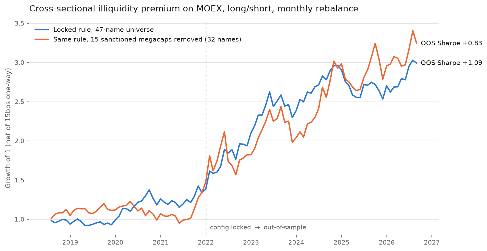

# moex-backtest

An event-driven backtesting engine for the Russian equity market (MOEX) and
the pre-registered research process built on top of it: a typed MOEX ISS /
Finam Trade API data layer, a lookahead-safe backtest loop, a live execution
adapter, and a statistical validation gate whose own statistical power has
been measured rather than assumed.

Three hypotheses have been run through that gate so far. Two were falsified.
One passed, with caveats stated below rather than buried.

## Research log

Every cycle is pre-registered before it runs: the hypothesis, the economic
mechanism, the trial budget and the pass criteria are written down and
committed first, and the in-sample/out-of-sample split is enforced by a
physical config lock (`validation/lock.py`), not by discipline.

| Cycle | Hypothesis | Mechanism | Verdict |
|---|---|---|---|
| 1 | Cross-sectional momentum (12-1) + low volatility | Under-reaction; volatility anomaly | **FAIL** — momentum DSR 0.124; low-vol p=0.91 |
| 2 | Multi-horizon momentum ensemble (J∈{3,6,9,12}) | Averaging away single-lookback noise | **FAIL** — DSR 0.025; all three robustness shifts negative |
| 3 | Cross-sectional illiquidity premium | Compensation for trading friction in a retail-dominated book | **PASS** — see below |

Cycle 2 is the informative failure: averaging over neighbouring, equally
well-motivated horizons *destroyed* the effect instead of confirming it —
the behaviour expected of noise, and the opposite of a real signal.

### Cycle 3 — illiquidity premium (the one that passed)

Long the least-liquid quintile, short the most-liquid, ranked by trailing
12-month mean daily traded value across a 47-name MOEX universe. Monthly
rebalance, 15bps one-way, 9 names per leg.

| Criterion | Result |
|---|---|
| OOS Sharpe (2022–2026) | **+1.087** |
| Walk-forward efficiency | 93.2% (mean OOS +0.895 over 7 windows) |
| Sensitivity | plateau — lookback 10–24m all in 0.97–1.13 |
| Monte Carlo percentile | 50.4 |
| DSR (mechanism-scoped N=6) | **0.980** |
| PBO / CSCV | 0.300 |
| OOS turnover | 6.1% of positions/month |



The shape of that curve is itself part of the finding: the premium is close to
flat through the in-sample years and does most of its work after 2022. That is
what "regime-conditional" looks like, and it is why the caveats below are not
boilerplate. (Chart: `strategies/CrossSectionalFactors/plot_cycle3.py`. Note the
line labels are OOS Sharpe, not cumulative growth — removing the megacaps raises
total growth while lowering the risk-adjusted OOS result, which is the quantity
the verdict is about.)

**Read the number as an upper bound, not a forecast.** Three things keep this
from being a clean story, and all three are in
`strategies/CrossSectionalFactors/reports/cycle3_illiquidity.md`:

1. **It is regime-conditional, not structural.** The short leg is 71% of the
   same 15 sanctioned megacaps in every OOS month — but it was 81% those same
   names *before* 2022 too, so the construction did not start capturing them
   post-sanctions; their relative returns changed. Excluding those 15 names
   entirely still leaves an OOS Sharpe of +0.827, so this is not purely a
   segmentation trade — but roughly a quarter of the measured edge is, and
   the 32-name version's own in-sample signal (p=0.107) would not clear the
   gate as a fresh hypothesis. Stated reversal condition: a durable reopening
   of MOEX to foreign capital, or sanctions relief on those names.
2. **Survivorship bias is confirmed and unquantified.** The 47-name universe
   was chosen in 2026 and therefore contains no company that was delisted in
   between. Finam's `AllAssets(only_disabled=true)` returns 267 archived MOEX
   equities, of which 100 are genuine disappearances with no successor in the
   universe. Uralkali (URKA) is a concrete instance: it traded through this
   cycle's own in-sample period at a median ₽2.4M/day — nine times thinner
   than the thinnest name in the current universe, so it would certainly have
   been in the long leg, and it is invisible here. Sizing that bias needs a
   point-in-time universe, which has not been built.
3. **The in-sample signal is marginal.** Phase A1 p=0.076 against a 0.10
   cutoff, and PBO=0.300 clears the <0.5 bar without being comfortable.

## The validation gate, and its measured power

Candidates must clear all six criteria: bootstrap significance, walk-forward
efficiency, sensitivity plateau, Monte Carlo, Deflated Sharpe Ratio (Bailey &
López de Prado), and PBO/CSCV. The modules operate on bare return series and
are reusable outside this repo.

The part worth a reviewer's attention is that the gate was itself measured.
`scripts/gate_power_analysis.py` block-bootstraps the real, demeaned momentum
residual, injects a known drift, and runs the whole gate over 250 replicates
per point — the same `validation.*` functions the cycles used, not a
reimplementation:

| True Sharpe | Full-gate pass rate |
|---|---|
| 0.00 | **0.0%** (Type I error) |
| 1.00 | **1.6%** |
| 2.00 | **26.8%** |

The gate barely admits noise and admits real effects rarely. The binding
constraint is DSR, and `reports/why_no_alpha.md` works out why: DSR's
threshold `E[max SR|H0]` deflates by the number of trials searched and is
**invariant to sample size**, so an effect below it converges toward certain
failure as more data arrives. At the project-wide trial count this track had
accumulated, a true Sharpe of 0.562 could not have passed at any sample size
— including a century of data. That is DSR working as designed, and it is
why the trial-counting convention was revised
(`strategies/CrossSectionalFactors/N_CONVENTION.md`): mechanism-scoped N goes
into the formula, the project-wide count is reported beside it.

**That audit found a bug in itself.** The first release of the power analysis
resampled a noise template that was never demeaned despite its docstring
claiming otherwise, so every "true Sharpe = X" row silently measured `X` plus
that series' own historical Sharpe. Fixing it moved the headline power at
SR=1.0 from 38.4% to 1.6% — the corrected numbers are the ones above.

## Architecture

```
data/       MoexISSClient + FinamClient (typed, paginated, retrying) + ParquetCache
metrics/    Sharpe, Sortino, max drawdown, Calmar, historical VaR/CVaR — pure functions
engine/     events (Bar/Signal/Order/Fill) -> Portfolio -> SimulatedBroker -> Backtester
strategy/   Strategy protocol + SmaCrossoverStrategy (the engine's smoke test)
execution/  FinamBroker: live order placement/cancel + account & position sync
validation/ significance, walk-forward, sensitivity, Monte Carlo, DSR, PBO/CSCV, lock
```

Data flow per bar, inside `Backtester.run`:

```
pending orders (from bar t-1) --[SimulatedBroker]--> fills --> Portfolio.apply_fill
                                                                       |
                                                          Portfolio.mark_to_market
                                                                       |
                                          Strategy.generate_signals(bar t, history<=t)
                                                                       |
                                          Portfolio.orders_from_signals --> pending orders (for bar t+1)
```

**The loop structurally prevents lookahead.** A strategy sees bars only up to
and including the current one. Orders sized from bar *t*'s signal execute at
bar *t+1*'s **open**, never at bar *t*'s own close;
`tests/test_backtester.py` asserts exactly this.

**Costs are modelled on every fill** — proportional commission plus fixed-bps
slippage against the trade direction. Turnover shows up as a real cost in the
summary metrics.

## Data access

Anonymous MOEX ISS caps individual-equity history at ~35 trading days
regardless of the range requested (indices and FORTS are not capped).
`FinamClient` lifts that: JWT auth against the Trade API, transparent token
refresh, and automatic chunking of arbitrary date ranges across the API's
365-day-per-request depth limit. Verified end-to-end — 5 years of daily SBER
bars, 1372 trading days, via `scripts/finam_history_check.py`.

## Live execution

`moex_backtest.execution.FinamBroker` places, cancels and reconciles orders
and reads account equity, cash and positions. Two design decisions worth
naming, both about real money:

- **Orders are never retried at the transport level.** The data client
  retries on 429/5xx, which is right for bars and wrong for a POST that may
  already have reached the matching engine. `place_order` disables that retry
  and raises `OrderSubmissionUncertainError` carrying the `client_order_id`;
  the caller resolves it with `find_by_client_order_id`, never by re-sending.
- **The broker is the source of truth for positions**, not an internal tally,
  which a restart, a partial fill or a manual intervention silently breaks.

`scripts/finam_account_check.py` exercises auth → account → orders read-only
against the live API. Still open: wiring target weights through to sized live
orders, and the risk limits that belong between them.

## Engine smoke test

Separately from the research above, the engine itself is exercised end-to-end on
real IMOEX data (2018-01-03 – 2026-08-11, 1M RUB, 0.04% commission, 5bps
slippage). `SmaCrossoverStrategy` has no demonstrated edge and is not a research
result — it is here to prove the loop, the cost model and the metrics work
against real data:

| Strategy | Ann. return | Sharpe | Max DD | Trades |
|---|---:|---:|---:|---:|
| Buy & Hold | 0.9% | 0.17 | -55.3% | 1 |
| SMA(10,50) | 3.2% | 0.32 | -29.2% | 140 |
| SMA(20,100) | 2.1% | 0.23 | -27.5% | 83 |
| SMA(50,200) | 2.1% | 0.22 | -36.2% | 29 |

Full table `reports/assets/results.csv`; writeup `reports/report.pdf`.

## Installation and use

Requires Python 3.12+ and [uv](https://docs.astral.sh/uv/).

```bash
uv sync
uv run python scripts/run_demo.py               # engine smoke test on real IMOEX data
uv run python strategies/CrossSectionalFactors/trial_ledger.py   # current trial counts
```

```bash
uv run pytest          # 191 tests, coverage configured in pyproject.toml
uv run ruff check .
uv run mypy src tests  # strict mode
```

CI runs lint, type check and tests on every push and PR.

## Limitations

- Survivorship bias in the universe is confirmed but not sized (above).
- Cost model is linear commission + fixed-bps slippage — no order book, no
  market impact, no partial fills. Cycle 3's result is flat to cost
  assumptions up to 100bps because turnover is low, but that does not cover
  the cost of *initially building* a position in thin names.
- Risk-free rate defaults to 0.0 in `summary()`. RUB rates ran 10-20%+ over
  most of this window, so absolute Sharpe values are relative-return ratios,
  not excess-return ratios.
- The engine's `Backtester` is single-symbol; cross-sectional cycles run
  through their own panel code in `strategies/`.
- `SmaCrossoverStrategy` exists to exercise the engine end-to-end; it has no
  demonstrated edge.
