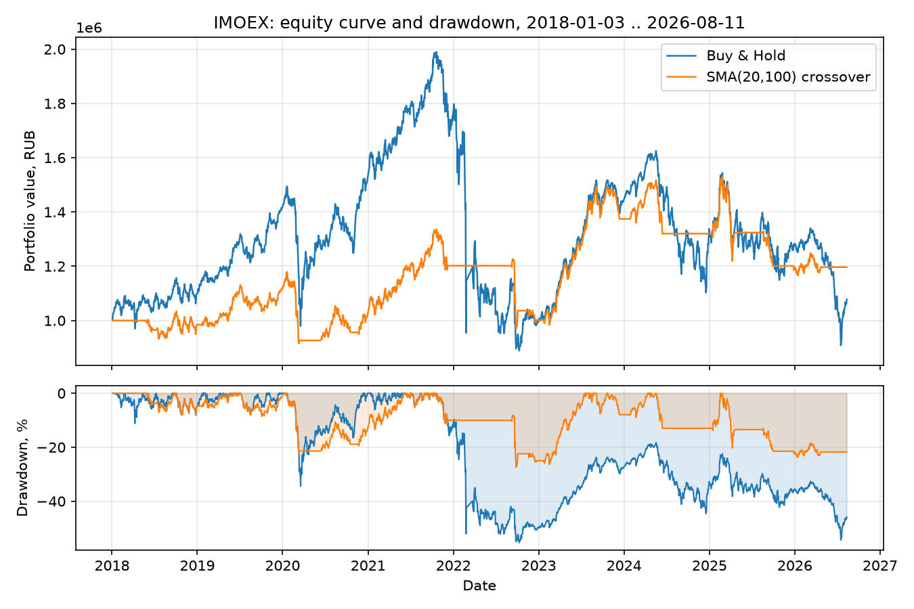

# moex-backtest

An event-driven backtesting engine and strategy research toolkit for the
Russian market (MOEX), built from scratch: a typed MOEX ISS data client, a
lookahead-safe backtest loop, cost-aware execution simulation, and the
standard risk/return metric set (Sharpe, Sortino, max drawdown, CVaR,
Calmar).

## Why this exists

This is the infrastructure layer for a strategy I plan to enter into
[Финам Арена](https://arena.finam.ru/) — the engine here is built so the
same `Strategy` protocol and cost model can later be pointed at a live
Trade API execution backend instead of the simulated broker, without
touching the strategy code.

## Methodology

- **The loop structurally prevents lookahead.** A strategy sees
  bars only up to and including the current one
  (`generate_signals(bar, history)`). Orders sized from bar *t*'s signal are
  executed at bar *t+1*'s **open**, never at bar *t*'s own close.
  `tests/test_backtester.py` pins this down with an explicit assertion: a
  signal sized off bar *N*'s close fills at bar *N+1*'s open, never at bar
  *N*'s own price.
- **Costs are modelled on every fill:** a proportional commission plus
  fixed-bps slippage against the trade direction (`engine/broker.py`). A
  strategy that trades often bleeds visibly to costs in the summary metrics.
- **v1 is single-symbol.** Cross-asset portfolio construction (gross/net
  exposure across a book, correlation-aware sizing) is a separate design
  problem — see Roadmap.
- **MOEX ISS anonymous access is depth-limited for individual equities**
  (~35 trading days regardless of the requested date range; indices and
  FORTS futures/options are not depth-limited) — see
  `moex_backtest.data.moex_iss.MoexISSClient` for the full quirk and why
  `scripts/run_demo.py` backtests an index rather than a single stock.
- **Risk-free rate defaults to 0.0** in `BacktestResult.summary()`. RUB
  rates have run 10-20%+ over most of this backtest's window, so the
  headline Sharpe/Sortino numbers below are relative-return ratios, not
  ratios against the real RUB risk-free curve — see Limitations.

## Architecture

```
data/       MoexISSClient (typed, paginated, retrying HTTP client) + ParquetCache
metrics/    Sharpe, Sortino, max drawdown, Calmar, historical VaR/CVaR — pure functions
engine/     events (Bar/Signal/Order/Fill) -> Portfolio -> SimulatedBroker -> Backtester
strategy/   Strategy protocol + SmaCrossoverStrategy (the engine's smoke test)
```

Data flow per bar, inside `Backtester.run`:

```
pending orders (from bar t-1) --[SimulatedBroker]--> fills --> Portfolio.apply_fill
                                                                       |
                                                          Portfolio.mark_to_market
                                                                       |
                                          Strategy.generate_signals(bar t, history<=t)
                                                                       |
                                          Portfolio.orders_from_signals --> pending orders (for bar t+1)
```

## Results (real IMOEX data, 2018-01-03 – 2026-08-11)

Starting capital 1,000,000 RUB. Commission 0.04%, slippage 5bps per trade
unless noted. `sharpe_ratio`/`sortino_ratio` use the standard convention:
per-period mean return over per-period standard deviation, scaled by
`sqrt(252)` — see `metrics/performance.py`. `Trades` (`num_trades` in
`summary()`) counts individual fill events, not round-trip entry/exit
pairs — a position opened and later closed counts as 2, not 1.

| Strategy | Ann. return | Ann. vol | Sharpe | Sortino | Max DD | Calmar | Trades |
|---|---:|---:|---:|---:|---:|---:|---:|
| Buy & Hold | 0.9% | 25.3% | 0.17 | 0.22 | -55.3% | 0.02 | 1 |
| SMA(10,50) | 3.2% | 12.1% | 0.32 | 0.43 | -29.2% | 0.11 | 140 |
| SMA(20,100) | 2.1% | 12.8% | 0.23 | 0.30 | -27.5% | 0.08 | 83 |
| SMA(50,200) | 2.1% | 13.3% | 0.22 | 0.31 | -36.2% | 0.06 | 29 |
| SMA(20,100), zero costs* | 2.4% | 12.8% | 0.25 | 0.33 | -27.4% | 0.09 | 83 |

\* Illustrative: same run with commission and slippage set to zero. Realistic
costs cost SMA(20,100) about 0.02 Sharpe points and 0.03 Sortino points over
83 trades across 8.5 years. Full table: `reports/assets/results.csv`;
formatted writeup: `reports/report.pdf`.



SMA(20,100) barely participates in the early-2022 crash and gives up
upside during the 2020-2021 rally in exchange — the standard trend-following
trade-off between drawdown and participation, visible in the drawdown panel:
its trough is roughly half the depth of buy-and-hold's.

## Installation

Requires Python 3.12+ and [uv](https://docs.astral.sh/uv/).

```bash
uv sync
```

## Usage

Run the end-to-end demo (fetches real IMOEX history via MOEX ISS, caches it
to `data/raw/`, backtests a SMA(20, 100) crossover, prints metrics):

```bash
uv run python scripts/run_demo.py
```

Minimal example against your own data:

```python
from moex_backtest.engine import Backtester, SimulatedBroker
from moex_backtest.strategy import SmaCrossoverStrategy

strategy = SmaCrossoverStrategy(fast_window=20, slow_window=100)
backtester = Backtester(strategy, initial_cash=1_000_000.0, broker=SimulatedBroker())
result = backtester.run(
    bars, symbol="IMOEX"
)  # bars: DataFrame with TRADEDATE/OPEN/HIGH/LOW/CLOSE/VOLUME

print(result.summary())  # annualized_return, sharpe_ratio, max_drawdown, ...
```

## Development

```bash
uv run pytest        # tests + coverage (configured in pyproject.toml)
uv run ruff check .  # lint
uv run ruff format .
uv run mypy src tests  # strict mode
```

CI (`.github/workflows/ci.yml`) runs lint, type check, and tests on every
push and PR.

## Roadmap

- Multi-symbol portfolio with gross/net exposure and CVaR-based risk limits
  (the risk-oriented portfolio construction from my coursework project is
  the natural next step here).
- Execution adapter for the Finam Trade API, so the same `Strategy` can run
  live in Финам Арена instead of against `SimulatedBroker`.
- A strategy actually worth trading — `SmaCrossoverStrategy` is here purely
  as an end-to-end smoke test for the engine.

## Limitations

- Risk-free rate defaults to 0.0 in `summary()`; pass a realistic RUB rate
  if the absolute Sharpe/Sortino value matters, not just its sign or
  cross-strategy ranking.
- v1 is single-symbol; no cross-asset exposure limits or correlation-aware
  sizing.
- Cost model is linear commission + fixed-bps slippage — no order book, no
  market impact, no partial fills.
- Anonymous MOEX ISS access caps individual-equity history at ~35 trading
  days; only indices and FORTS derivatives have full depth without an
  authenticated session.
- `SmaCrossoverStrategy` exists to exercise the engine end-to-end; it has no
  demonstrated edge.
